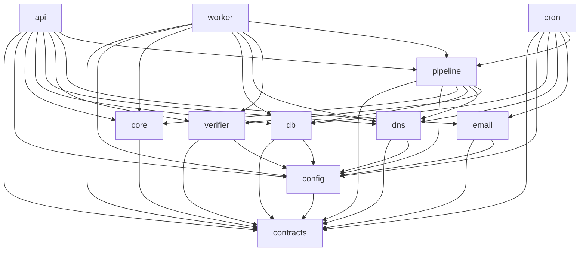

# mailmetero — FINAL Architecture (authoritative, implementation-ready)

**Status:** BINDING. Merges the shared foundation (`architecture/CONTRACTS_CORE.md`), the 6 domain
designs, and every blocker/major fix from the 3 verifiers. **Owner:** Lead architect. **Date:** 2026-07-19.

**Authority chain:** `ideation/PRD.md` §8 (D1–D23) and §3 (API surface) are BINDING and override everything
below on conflict. `CONTRACTS_CORE.md` is the operational TypeScript projection of the PRD and is imported
verbatim by `@mailmetero/contracts`. This document + `MODULE_CONTRACTS.md` + `SCHEMA.md` +
`FILE_MANIFEST.md` + `BUILD_ORDER.md` are the implementation spec. Where a domain design conflicted with
another, **this document's reconciliation wins** and the individual designs are superseded.

---

## 1. What mailmetero is

A hosted, multi-tenant email **finder + verifier** HTTP API (TypeScript / Node 26, node-postgres, Neon
Postgres, Render web+worker+cron). Successor to the offline "BounceZero". It **derives** the most likely
address for a person at a domain (never fetches LinkedIn / never scrapes) and **verifies** addresses via a
third-party HTTPS verifier, returning Hunter-compatible responses with additive native fields, calibrated
confidence bands, and per-result provenance.

Product-defining constraints (all mechanically enforced — see §7):
derivation-only · shared `kb.*` schema has **no** person columns (CI-enforced) · **no** cross-tenant
per-address verdict cache · Postgres `FOR UPDATE SKIP LOCKED` queue (no Redis) · HMAC-SHA256 API keys ·
suppression checked pre-derivation AND pre-verification, observationally equivalent to not-found ·
M365 / catch-all score capped at 84, **never `valid` from a 250**.

---

## 2. Module map & dependency DAG (the product's spine)

Eleven `@mailmetero/*` packages under `packages/`, pnpm workspaces, strict acyclic DAG enforced by
`dependency-cruiser`. `@mailmetero/contracts` is the only universal import and imports nothing internal.

```
L0  contracts
L1  config ──▶ contracts             core ──▶ contracts
L2  db ──▶ contracts, config         dns ──▶ contracts, config
    verifier ──▶ contracts, config   email ──▶ contracts, config
L3  pipeline ──▶ contracts, config, core, db, dns, verifier
L4  api ──▶ contracts, config, core, db, dns, verifier, email, pipeline
    worker ──▶ contracts, config, core, db, dns, verifier, pipeline
    cron ──▶ contracts, config, db, dns, email, pipeline
```



| Package | Responsibility | Owns DB tables? |
|---|---|---|
| `contracts` | Enums, registries, branded types, wire shapes, `ScoringConfig` shape + seed. | — |
| `config` | Typed env, egress allowlist, logger, `AppConfig` sub-configs, scoring bootstrap validator. | — |
| `core` | Pure BounceZero derivation: name parse/NFKD/German/CJK/nickname, canonicalizers, role/freemail/typo classifiers, candidate generation + dual collision candidates, blend scoring + caps. **No I/O.** | — |
| `db` | **Sole owner of every Postgres object.** Pools (pooled/unpooled), migrations, all repositories, live `ScoringConfig` loader, seed loaders, the single pure `decideBilling` policy, and the kb-no-PII CI invariant. | **ALL** |
| `dns` | DoH resolver, typed `MxEnum`, MX-suffix provider fingerprint. | — |
| `verifier` | `VerifierBackend` impls (HTTPS-api + null), enhanced-code classifier, catch-all probe. | — |
| `email` | Postmark-class ESP thin interface + templates. | — |
| `pipeline` | Cheapest-first orchestrator (stages 0–8) + candidate generation + **the internal→wire mapper** (importable by api and worker) + canonical internal result types. | — |
| `api` | Fastify `/v2` web service: routes, auth, rate-limit, idempotency, billing headers, OpenAPI, sandbox. Maps internal→wire via pipeline's mapper. | — |
| `worker` | SKIP LOCKED job consumer (bulk finds/verifies + 202-async verify). | — |
| `cron` | TTL purge, blocklist re-seed, stuck-job sweep, quota/spend reset, credit-back sweep, quota alerts, objection expiry. | — |

> **Blocker resolution (all 3 verifiers): DB table ownership collision.** The original two domains
> (`data-layer-schema` and `jobs-billing-compliance`) each authored migrations creating the SAME tables
> (`jobs`, `job_items`, `usage_ledger`, `idempotency_keys`, `ops.verifier_spend`, `suppression_global`,
> `objection_requests`, the kill-switch table) with conflicting DDL in one migration history — `pnpm
> migrate up` would fail on `relation already exists`. **Resolved by collapsing all Postgres ownership into
> a single `@mailmetero/db` package (implementation unit U4) with one migration history (0000–0008), one
> definition per table, one repo per table.** See `SCHEMA.md` for the reconciled DDL.

---

## 3. Request & data flows

### 3.1 Finder — `GET /v2/email-finder` (sync, ~8s budget)

```
client ─▶ api
  onRequest:  request-id → auth (Bearer/api_key=, HMAC prefix lookup + constant-time compare)
  preHandler: GET idempotency (24h request-hash replay, no re-bill) → attempt rate-limit
  handler:
    if sk_test_  → SandboxRouter fixture (0 credits) ─▶ 200
    domain missing → domain_required (400)
    name missing   → validation_error (400)
    canonicalize via @mailmetero/core: normalizeName(...) → NameInput ; classifyDomainInput(...) → DomainInput
    pipeline.find({tenantId, requestId, name, domain, budgetMs = ScoringConfig.caps.FINDER_BUDGET_MS})
      stage 0 canonicalize/syntax   (finder inputs already canonical; no-op)
      stage 1 suppression           → DOMAIN-scope hash check; suppressed ⇒ not-found terminal
      stage 2 classification        → webmail/disposable/role terminal (FREE)
      stage 3 tenant cache          → per-tenant TTL-fresh verdict reuse (billingReason free_cache_dedupe)
      (candidate generation)        → core.generateCandidates(name,domain,priors,config,domainSupport?) → ~25
      stage 4 kb domain facts       → Null-MX/no-mail-host terminal; KB catch-all/M365 ⇒ skip paid verify
      stage 5 dns enum (DoH)        → MxResolution; NULL_MX⇒invalid, IMPLICIT_MX flag (cap 60)
      stage 6 provider fingerprint  → M365(UNVERIFIABLE)/known catch-all SHORT-CIRCUIT ⇒ capped accept_all (≤84)
      stage 7 verifier backend      → verify top-3 (google_workspace runs CatchAllProbe first); budget→null degrade
      stage 8 score + writeback     → core.scoreDerivation per candidate; ADDRESS-scope suppression filter on
                                       chosen candidate; write kb.domains + kb.domain_patterns (D7 write-guard)
      returns PipelineFinderOutput { ok: InternalFinderResult + BillingInput | input_error | unavailable }
    api: decideBilling(billingInput, caps)   [imported from @mailmetero/db — the SINGLE definition]
    api TX: ResultsRepo.insert (results row + billed flag) → resultId
            LedgerRepo.recordAttempt (idempotent on tenant+request_id) [+ billable + TenantsRepo.tryDebitCredit]
    toFinderResult(internal)  [pipeline's wire mapper] → wire FinderResult
    onSend: X-Request-Id, X-Billed, X-Credits-Remaining, X-RateLimit-* (+ Deprecation on api_key=)
  ─▶ 200 {data: FinderResult, meta}
```

### 3.2 Verifier — `GET /v2/email-verifier` (sync fast-path → 202 async)

Same cross-cutting chain. `pipeline.verify` runs with `ScoringConfig.caps.SYNC_VERIFY_BUDGET_MS` (~2s).
Stage 1 checks BOTH address- and domain-scope suppression. Outcomes:
- `ok` → `toVerifierResult` → 200; billing settled.
- `deferred` (sync budget exceeded on a verifiable provider) → `JobsPort.enqueueVerification` → **202 +
  `Location: /v2/verifications/{id}`**, `X-Billed: 0`.
- `input_error` → `invalid_email` / `validation_error` (400). `unavailable` (kill switch / hard outage) →
  `verification_unavailable` (503).

`GET /v2/verifications/{id}` polls: `done` → 200 (wire `VerifierResult` read straight from `job_items`);
`pending` → `job_pending` 202 + `Retry-After`; `failed` → `verification_unavailable`; missing → `not_found`.

### 3.3 Bulk — `POST /v2/bulk/{finds,verifications}`

`Idempotency-Key` required (reserve/replay/conflict). `>1000` rows → `payload_too_large`. Enqueue one
`jobs` row + N `job_items` in one tx → **202 `{job_id,status,count}`**. Bulk rows are **not** rate-limited
or billed at accept time — per-row billing happens in the worker. `GET /v2/bulk/{id}` → status;
`GET /v2/bulk/{id}/results` → paginated wire rows + `meta{total,next_offset}`.

### 3.4 Worker (SKIP LOCKED consumer)

```
loop: claim(batch) via UPDATE…FROM(SELECT … FOR UPDATE SKIP LOCKED) on the UNPOOLED pool
  per job → per item (itemConcurrency semaphore):
    per-item requestId = `${job.requestId}:${rowIndex}`   [deterministic; reused on requeue]
    pipeline.find/verify → internal result + BillingInput + resultId
    decideBilling(billingInput, caps)          [SAME db function as api]
    TX: ResultsRepo.insert → LedgerRepo.recordAttempt (idempotent) [+ debit]
    toFinderResult/toVerifierResult (pipeline mapper) → JobsRepo.recordItemResult(itemId, WIRE result, resultId)
  heartbeat visibility; completeJob / releaseJob(backoff) / failJob
  claim==0 ⇒ sleep random [30s,60s]   (Neon CU-hour discipline, D20)
```

### 3.5 Deployment topology (Render, D15/D20/D23)

- **web** (`mailmetero-api`, Starter, oregon): Fastify. Binds **pooled** Neon `-pooler` DSN. Runs migrations
  ONCE in `preDeployCommand: pnpm migrate up` on the **unpooled** DSN. `healthCheckPath: /healthz`.
- **worker** (`mailmetero-worker`, Starter): binds **unpooled** DSN (SKIP LOCKED + long tx).
- **cron** (7 services, Starter): each `node packages/cron/dist/main.js <name>` on the **unpooled** DSN.
  All 7 CronJobNames get a Render service (see §7 fix table): `ttl-purge`, `stuck-job-sweep`,
  `quota-spend-reset`, `credit-back-sweep`, `quota-alert`, `blocklist-sync`, `objection-expiry`.

`SERVICE_ROLE` per service selects pooled(web) vs unpooled(worker/cron) via `AppConfig.database.urlForRole`.

---

## 4. Persistence & billing boundary (reconciled)

This is the single most-contested seam across domains. Final rules:

1. **Pipeline** writes ONLY shared `kb.*` (domain facts + pattern observations) in stage 8 via
   `KbWritebackPort`. It **never** writes `results`, `usage_ledger`, or debits credits, and **never**
   computes billing. It returns `InternalFinderResult`/`InternalVerifierResult` **plus a `BillingInput`**
   (endpoint, status, subStatus, score, backend, evidence, hasEmail) and `deferrable`.
2. **`decideBilling(BillingInput, HardCaps)`** is a single pure function in `@mailmetero/db`
   (`src/billing/policy.ts`). Both `api` (sync) and `worker` (bulk/async) import it. **No other billing
   predicate exists** — `api`'s old `computeBillingIntent` and `core`'s `billing.ts` are removed.
3. **api / worker** own the tenant-scoped atomic transaction: `ResultsRepo.insert` (results row + `billed`)
   → `LedgerRepo.recordAttempt` (idempotent on `(tenant_id, request_id)` — retries physically cannot
   double-bill) → conditional billable + `TenantsRepo.tryDebitCredit`.
4. **Two dedupe layers, both free-on-hit, distinct keys:** (a) api-level GET replay = `idempotency_keys`
   `scope='request_hash'` (24h, replays the exact stored envelope, `X-Billed:0`, no pipeline call);
   (b) pipeline stage-3 tenant cache = `results` per-tenant TTL-fresh verdict reuse (`billingReason=
   free_cache_dedupe`). Neither can double-bill.

---

## 5. Billing rule (corrected — verifier blocker/major)

`decideBilling` (the ONE definition) implements PRD §4.1 / D11 **using evidence tier, not `backend`, to
detect degradation** — this fixes the "DNS-terminal invalids billed free" bug:

- **Verifier billable ⟺** `status ∈ {valid, invalid}` AND `subStatus ≠ invalid_syntax` AND
  `evidence ≠ degraded`.
  - `null_mx` / `no_mail_host` → `status='invalid'`, `evidence='dns'`, `backend='none'` ⇒ **BILLABLE**
    (they are definitive DNS verdicts; the old `backend!=='none'` gate wrongly made them free).
  - Budget/outage degrade → `status='unknown'`, `evidence='degraded'` ⇒ free (also excluded by status).
- **Finder billable ⟺** `hasEmail` AND `score ≥ caps.FINDER_BILLABLE_MIN (70)` AND `status ≠ accept_all`
  AND `evidence ≠ degraded`. (D12 spend-cap/kill degrade sets `evidence='degraded'` ⇒ unbilled.)
- `invalid_syntax` and any `evidence='degraded'` result are always free.

Auto **credit-back** on 30-day downgrade is a `usage_ledger` `+1 credit_back` row (unique per attempt),
issued by the `credit-back-sweep` cron.

---

## 6. Kill switch, spend caps, units (reconciled)

- **One kill-switch/policy table:** `ops.verifier_policy` (singleton row: `kill_switch_enabled`,
  `global_daily_cap_cents`). `ops.service_flags` and the recommended `ops.feature_flags` are **removed**.
  `SpendGuard` / `VerifierPolicyRepo` read this one table. The env `KILL_SWITCH_VERIFIER` is the fail-safe
  boot default (`verifierEnabled(env)`); the DB row is the live flip without redeploy.
- **One spend unit: integer cents, end-to-end.** `config` parses USD env → cents at load
  (`globalDailyVerifierSpendCapCents`, `defaultTenantDailyVerifierSpendCapCents`);
  `tenants.daily_verifier_spend_cap_cents`; `ops.verifier_spend.spend_cents`; `SpendGuard.record(cents)`.
- **Degrade, don't error:** tenant/global cap hit ⇒ `SpendDecision.reason ∈ {tenant_cap, global_cap}` ⇒
  finder/verifier degrade to `backend='none'`, `evidence='degraded'` (unbilled). Only `kill_switch` on the
  pure verifier endpoint surfaces `verification_unavailable` (503). api and worker apply this mapping
  identically via the shared `SpendDecision` enum.

---

## 7. How every hard constraint & verifier finding is mechanically enforced

### 7.1 Product hard constraints

| Constraint | Mechanism |
|---|---|
| Derivation-only, no LinkedIn fetch | `linkedin_url` parsed as text only; egress allowlist (code choke point) makes LinkedIn structurally unreachable; ESLint bans raw `fetch`/`http(s)`/`undici`/`axios` outside `@mailmetero/config`. |
| `kb.*` has no person columns | `db.assertKbHasNoPersonColumns` introspects `information_schema.columns WHERE table_schema='kb'` against a **closed allowlist** + person denylist regex; CI test migrates a scratch DB and fails on any column outside the allowlist. **This runtime check is the authoritative D7 gate**; the config-side source grep is secondary. |
| No cross-tenant per-address verdict cache (D1) | Per-address verdicts live only in the per-tenant `results` table; `kb.*` stores domain-level facts only; a CI grep + the kb-no-PII invariant prevent an email/name column in `kb.*`. |
| SKIP LOCKED queue, no Redis | `jobs` + `job_items`; `claim()` = `UPDATE…FROM(SELECT…FOR UPDATE SKIP LOCKED)` on the unpooled pool; partial index `WHERE status='queued'`. |
| HMAC-SHA256 API keys | `api_keys(key_prefix indexed, key_hash = HMAC-SHA256(secret, APP_PEPPER))`; `KeyAuthenticator` recomputes + constant-time compares inside `@mailmetero/db`; pepper never leaves db. |
| Suppression pre-derivation AND pre-verification, observationally == not-found | `makeSuppressionStage` at buildStages index 1 with `appliesTo=['finder','verifier']`; finder also runs an ADDRESS-scope filter in stage 8 on the chosen candidate; suppressed ⇒ constant-shaped not-found `PipelineResult` (`billingReason=free_suppressed_notfound`); **no** suppression member exists in any enum/registry (`no-suppression-leak` CI grep). |
| M365 / catch-all capped 84, never `valid` from 250 | Enforced in TWO places: stage 6 short-circuits `microsoft365`/known catch-all before paid verify (capped `accept_all` ≤84); `createHttpsApiBackend` output-clamps UNVERIFIABLE/UNKNOWN classes so they can never emit `valid`; `core.scoreDerivation` caps read from `ScoringConfig.caps` (no literal `84`/`60`/`55`/`70` in scoring code — ESLint rule); CI property test asserts `m365 || isCatchAll ⇒ score≤84 && status≠valid`. |

### 7.2 Verifier BLOCKER fixes (all applied)

| # | Blocker | Resolution |
|---|---|---|
| B1 | Two domains own & CREATE the same DB tables (migrate crashes) | Single `@mailmetero/db` owner, one migration history 0000–0008, one definition/repo per table (§2, `SCHEMA.md`). |
| B2 | `db` imports `AppConfig` that `config` never exports | `config` now exports `AppConfig` with `database` / `api` sub-configs (`MODULE_CONTRACTS.md` §config); `db.pool.ts` consumes `AppConfig['database']`. |
| B3 | `suppression_global` incompatible columns (`suppression_hash`/id vs `hash` PK) | Single hash-only definition: `suppression_global(hash text PK, scope, created_at)`. |
| B4 | `objection_requests` incompatible + plaintext-vs-hash privacy conflict | Adopt the **hash-only** design: no plaintext email column; store `token_hash` + precomputed `subject_suppression_hash`/`domain_suppression_hash`; plaintext exists only transiently in memory to send the confirmation mail (D5/D6). |
| B5 | `ops.verifier_spend` incompatible shape + cents/credits/USD units | Single definition in **cents**; `scope_tenant_id` NULL=global, `NULLS NOT DISTINCT` unique (§6). |
| B6 (DB) | `usage_ledger.day` STORED generated column uses non-IMMUTABLE `timestamptz→date` (migration fails) | Use `occurred_on date NOT NULL DEFAULT ((now() AT TIME ZONE 'utc')::date)` (DEFAULT permits STABLE); repo may set it explicitly. **No GENERATED column.** |

### 7.3 Verifier MAJOR fixes (all applied)

| Major | Resolution |
|---|---|
| api `PipelinePort` vs pipeline `Pipeline` type mismatch; api re-declares result types | **Pipeline is the canonical owner.** It exports `Pipeline`, `FinderRequest`/`VerifierRequest`, `PipelineFinderOutput`/`PipelineVerifierOutput`, `InternalFinderResult`/`InternalVerifierResult`. `api` imports these; the re-declared `PipelinePort`/`InternalFinderResult` in `api/deps.ts` are removed. |
| Internal→wire mapping unreachable from worker (§0.1 said api-only) | **Mapper relocated to `@mailmetero/pipeline` (`src/wire.ts`).** Both api and worker import `toFinderResult`/`toVerifierResult`/`toBulkFinderRow`/`toWireCandidate`. `CONTRACTS_CORE §0.1` is amended accordingly. |
| Worker's `FinderRunner`/`VerifierRunner` not exported anywhere | Worker uses `Pipeline.find/verify` directly (pipeline output carries `resultId`+`BillingInput`); no separate runner interface needed. Documented in §3.4. |
| `CandidateGeneratorPort`/`ScorerPort` vs core signatures; evidence data-flow reversed; `ScoreOutput.status` too wide | Pipeline owns the **adapter** (the only layer allowed to bridge db-fed data into pure core): supplies `priors`/`config`/`domainSupport` to `core.generateCandidates`; decomposes evidence into `core.scoreDerivation` flat inputs; the scorer returns only `VerifyVerdict` for the derivation path — webmail/disposable/role/null_mx terminals are set by pipeline stages, documented as the Status-terminal split. |
| `DomainPatternSupport` two incompatible shapes (Map vs record) | Define the per-row `DomainPatternObservation` once in **contracts**; `core.DomainPatternSupport = ReadonlyMap<PatternToken, DomainPatternObservation>`; pipeline passes `DomainPatternObservation[]` and the adapter builds the map. |
| Kill-switch modeled in 3 tables | One `ops.verifier_policy` (§6). |
| Spend units in 3 units (cents/credits/USD) | Integer cents end-to-end (§6). |
| `tenants` columns read by billing don't exist | **Pinned `tenants` contract** owned by db: billing/spend read `credits_remaining`, `daily_verifier_spend_cap_cents`, `quota_period_start`; `TenantsRepo.resetQuotas` added (`MODULE_CONTRACTS.md` §db). |
| Billing predicate in 3 places | Single `decideBilling` in db (§4, §5). |
| `getUnpooledPool`/`resetTenantQuotas`/`refreshClassificationTables` not provided | Renamed to real db exports: `createDirectPool`/`createWebPool`/`withTransaction`; `TenantsRepo.resetQuotas` added; `refreshClassificationTables` = thin wrapper over `seedClassificationTables` against the **vendored** dir, injected into `blocklist-sync`. |
| `check-suppression-paths` targets nonexistent `pipeline/src/finder.ts`,`verifier.ts` | Rewritten to assert `buildStages()` includes `makeSuppressionStage` at index 1 with `appliesTo ⊇ {finder,verifier}` and that stage 8 references `SuppressionPort` for finder address filtering; file/marker contract pinned to `packages/pipeline/src/stages/suppression.ts` + `orchestrator.ts`. |
| `ApiConfig` fields don't exist in config; budgets duplicated (env vs ScoringConfig) | Budgets (`FINDER_BUDGET_MS`/`SYNC_VERIFY_BUDGET_MS`) read from `ScoringConfig.caps` via `ScoringConfigLoader`, **not** ApiConfig; remaining static fields (`bodyLimitBytes`/`bulkMaxRows`/`trustProxy`/`openApiVersion`/`jobPendingRetryAfterSeconds`) added to `config.AppConfig.api`. |
| `JobsPort.getVerification` internal vs `JobsRepo.getVerificationResult` wire | `job_items` store **wire** results (worker persists wire); api reads and returns wire `VerifierResult`/`BulkFinderRow`/`BulkVerifierRow` directly, no re-map. api's `JobsPort` narrowed to wire. |
| `JobType` missing `async_verify` (breaks D4 202-async) | Single `JobKind = 'bulk_find' \| 'bulk_verify' \| 'async_verify'` (`jobs` CHECK includes it). |
| Billing: DNS-terminal invalids billed free (contradicts §4.1) | Fixed via evidence-tier gate (§5). |
| Finder-path per-address suppression unwired (candidate gen stage unassigned) | Candidate generation placed in the orchestrator (after stage 3, before stage 4); stage 8 filters address-suppressed candidates (§3.1, §7.1). |
| render.yaml schedules only 4 of 7 crons (P0-9 credit-back, P0-14 quota-alert, objection-expiry unhomed) | render.yaml declares **all 7** cron services (§3.5). |
| Bulk per-item `request_id` undefined (under/double-bill) | Deterministic `job_items.request_id = ${job.request_id}:${row_index}`, reused verbatim on requeue (§3.4). |
| `db`↔`config` pool wiring won't compile | Resolved by B2 (`AppConfig.database`). |

### 7.4 Verifier MINOR fixes (applied)

- GET dedupe: single store = `idempotency_keys` `request_hash` (§4).
- `JobItemStatus`: added `JOB_ITEM_STATUSES=['pending','done','failed']` to contracts; both sides import.
- `Logger`: worker/cron/email import `Logger` from `@mailmetero/config` (no re-declaration).
- `core/tables.ts` vendor-list parsers **removed** (would violate db→core DAG); db's `seed/normalize.ts`
  is the sole vendor-file parser; core consumes injected classification sets only.
- kb-no-PII: db's runtime `information_schema` check is authoritative; config grep is secondary.
- blocklist-sync: **re-seeds from the vendored `data/vendor` files (zero egress)** — resolves both the
  missing egress-allowlist host AND the config→email DAG cycle. `raw.githubusercontent.com` is not added.
- `ScoringConfigRepo.activate`: one tx clears the active row before setting the new one (partial-unique
  `WHERE is_active` can't hold two); `loadActive` falls back to `DEFAULT_SCORING_CONFIG` only when zero
  active rows.
- Seed vendor dir resolved from an absolute anchor (`AppConfig` `vendorDir` / `new URL('../../../data/vendor', import.meta.url)`), never a cwd-relative literal.
- `usage_ledger` redaction + `objection_requests` expiry get supporting partial indexes (`SCHEMA.md`).
- Pooler `statement_timeout` set via DSN `options=-c` / pool `options`, never a post-connect `SET`;
  all session-scoped SET/LISTEN/advisory-lock usage confined to the direct (unpooled) pool.

---

## 8. Framework & tooling decisions (from foundation, unchanged)

- **Web framework: Fastify** (schema-first → OpenAPI-as-source-of-truth; hook lifecycle for the
  cross-cutting middleware; compiled serializer for 0.5-CPU Render dynos).
- **Test runner: `node:test`** (zero deps; Node 26 runs TS via type-stripping; aligns with the egress
  supply-chain-minimalism posture).
- **Workspace: pnpm** (isolated `node_modules` mechanically forbids phantom cross-package imports → the DAG
  is enforced at install time, backstopped by `dependency-cruiser`).
- **Migrations: `node-pg-migrate`** on the unpooled DSN; single history in `packages/db/migrations`.

---

## 9. Testing & CI compliance invariants (launch-gating)

Six compliance invariants run in CI (see `FILE_MANIFEST.md` U12 + `SCHEMA.md`):
1. **DAG intact** (`dependency-cruiser` + `check-dag`) — only §2 edges allowed, no cycles.
2. **Frozen registries** — snapshot pins `STATUSES/SUB_STATUSES/MX_ENUMS/PROVIDERS/REASON_CODES/ERROR_CODES`.
3. **No suppression leak** — grep registries for `suppress|object|blocked_contact`, fail on match.
4. **KB purity (D7)** — runtime `assertKbHasNoPersonColumns` on a scratch-migrated DB (authoritative).
5. **Cap ceilings** — property test: `m365 || isCatchAll ⇒ score≤84 && status≠valid`; `IMPLICIT_MX ⇒ ≤60`.
6. **Suppression on all paths** — `buildStages()[1] === makeSuppressionStage`, `appliesTo ⊇ {finder,verifier}`,
   and stage 8 uses `SuppressionPort` for finder address filtering.
Plus: OpenAPI response validation (`validateResponseAgainstSpec`) over every operation/status + every
sandbox fixture (status + numeric score + ≥1 reason_code + backend present), and `no-magic-numbers` ESLint
in scoring code.

Integration tests (`*.integration.test.ts`) are gated on `DATABASE_URL_TEST` (a throwaway Neon branch) and
**skip — never fail —** when absent (fork PRs).

---

## 10. What is deliberately out (v1 non-goals, PRD §9)

No LinkedIn/scraping (permanent), no domain-search/people-listing (`GET /v2/domains/{domain}` is the P1
replacement), no cross-tenant person data of any kind (incl. hashed verdict caches, D1), no email sending,
no headline accuracy %, no dashboard beyond signup/key/usage, no hand-maintained SDKs, no team/RBAC/SSO, no
CSV UI, no Stripe checkout at launch, no self-hosted SMTP probing (the P2 probe node is external only), no
homepage crawling, no phone/non-email enrichment, no CA data-broker registration.
