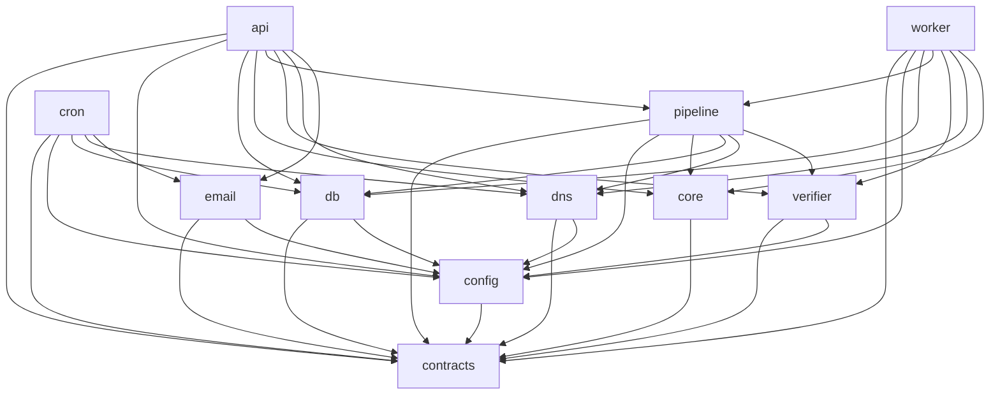

# CONTRACTS_CORE — mailmetero canonical shared vocabulary

**Status:** BINDING foundation. Imported (directly or transitively) by every downstream subsystem.
**Owner:** Lead architect. **Date:** 2026-07-19.
**Authority chain:** PRD `ideation/PRD.md` §8 (D1–D23) and §3 (API surface) override this doc on any conflict; this doc is the operational TypeScript projection of them. Research brief and `data/vendor/PROVENANCE.md` are advisory.

This file defines the SINGLE source of truth for enums, value types, the reason-code and error-code registries, the scoring-config shape, the module map + dependency DAG, the workspace layout, and the framework/test-runner decisions. **All of the TypeScript below lives in the `@mailmetero/contracts` package** (see §8). Nothing here does I/O; it is types + frozen constant arrays only.

---

## 0. Conventions (read first)

1. **Two casing worlds, deliberately.**
   - **Wire types** (HTTP request/response payloads) are **`snake_case`** to mirror Hunter exactly (D2). Types: `FinderResult`, `VerifierResult`, `SuccessEnvelope`, `ApiError`, bulk/account/usage shapes.
   - **Internal domain types** are **`camelCase`**: `NameInput`, `DomainInput`, `Candidate`, `VerificationEvidence`, `VerifyContext`, etc.
   - The `@mailmetero/api` package is the ONLY place that maps internal → wire. Everything upstream of it works in `camelCase`.

2. **Enums are const-arrays, not TS `enum`.** Every enum is `export const XS = [...] as const;` plus `export type X = typeof XS[number];`. This gives a **runtime array** (needed to generate the OpenAPI 3.1 spec, the sandbox fixture catalog, and CI response-validation), a **closed literal union** at compile time, and stable JSON values. Do not introduce `enum` or numeric enums anywhere.

3. **Registries are frozen.** `REASON_CODES` and `ERROR_CODES` are closed sets. Adding a member is a spec change that bumps the OpenAPI version and updates the docs/migration table. Removing or renaming a member is a breaking change.

4. **Branded primitives** (§4) exist so a raw `string` can never be passed where a canonicalized `Domain`/`EmailAddress` is required. Construct them only through the canonicalizers in `@mailmetero/core`.

5. **Privacy invariant (CI-enforced, D5/D6/§7).** No `Status`, `SubStatus`, `ReasonCode`, or `ErrorCode` value may reveal suppression. A suppressed subject is observationally identical to not-found. There is deliberately **no** `suppressed`, `objected`, `blocked_contact`, or equivalent member anywhere in this file. Any PR adding one fails the compliance test.

---

## 1. Enums

```ts
// ── Status (Hunter-compatible, FIXED; PRD §4.1) ─────────────────────────────
export const STATUSES = [
  'valid',       // definitive positive verify on a verifiable, non-catch-all provider
  'invalid',     // definitive negative
  'accept_all',  // domain accepts any local part; per-address deliverability unknowable
  'unknown',     // no definitive evidence
  'disposable',  // disposable/temp-mail domain
  'webmail',     // freemail domain (gmail.com …); never a derivation target
  'role',        // role account (RFC 2142 + extensions); excluded from person results
] as const;
export type Status = typeof STATUSES[number];

// ── SubStatus (every value in PRD §4.1) ─────────────────────────────────────
// Grouped by the parent Status they can appear under (see STATUS_SUBSTATUS below).
export const SUB_STATUSES = [
  // valid
  'ok',
  // invalid
  'invalid_mailbox',      // 5.1.1 from an honest provider
  'null_mx',              // RFC 7505 Null-MX — definitive reject
  'no_mail_host',         // no usable mail host
  'disabled',             // mailbox disabled/deactivated
  'invalid_syntax',       // fails RFC syntax — FREE, unbilled
  // accept_all
  'catch_all_confirmed',  // domain confirmed catch-all
  'provider_unverifiable',// M365 & equivalents — provider cannot be trusted per-address
  // unknown
  'timeout',
  'backend_unavailable',
  'gateway_blocked',      // 5.7.1 / policy block
  'implicit_mx_only',     // RFC 5321 A-record fallback only
] as const;
export type SubStatus = typeof SUB_STATUSES[number];

/** Which sub_status values are legal under each status. Enforced in response validation. */
export const STATUS_SUBSTATUS: Readonly<Record<Status, readonly SubStatus[]>> = {
  valid:      ['ok'],
  invalid:    ['invalid_mailbox', 'null_mx', 'no_mail_host', 'disabled', 'invalid_syntax'],
  accept_all: ['catch_all_confirmed', 'provider_unverifiable'],
  unknown:    ['timeout', 'backend_unavailable', 'gateway_blocked', 'implicit_mx_only'],
  disposable: [],
  webmail:    [],
  role:       [],
} as const;

// ── MxEnum (typed DNS result; PRD §6 stage 5) ───────────────────────────────
export const MX_ENUMS = [
  'EXPLICIT_MX',           // one or more MX records present
  'IMPLICIT_MX_FALLBACK',  // no MX, A/AAAA present (RFC 5321) — cap score at 60
  'NULL_MX',               // RFC 7505 "MX 0 ." — definitive reject, short-circuits FREE
  'NO_MAIL_HOST',          // no MX and no A/AAAA — cannot receive mail
] as const;
export type MxEnum = typeof MX_ENUMS[number];

// ── Provider (MX-suffix fingerprint; PRD §6 stage 6) ────────────────────────
export const PROVIDERS = [
  'microsoft365',     // *.mail.protection.outlook.com
  'google_workspace', // aspmx.l.google.com (custom domain, != gmail.com)
  'gmail_consumer',   // gmail.com / googlemail.com
  'yahoo_consumer',   // yahoo.* consumer
  'proofpoint',       // *.pphosted.com
  'mimecast',         // *.mimecast.com
  'ironport',         // Cisco IronPort gateways
  'barracuda',        // Barracuda ESG
  'zoho',             // Zoho Mail
  'proton',           // Proton
  'other',            // resolved MX, unrecognized fingerprint
] as const;
export type Provider = typeof PROVIDERS[number];

// ── VerifiabilityClass (per-provider verify strategy; RESEARCH_BRIEF §6 matrix) ─
export const VERIFIABILITY_CLASSES = [
  'UNVERIFIABLE',                 // microsoft365 — never VALID from 250; pattern confidence IS the product
  'UNKNOWN',                      // gmail_consumer, yahoo_consumer — never assert valid
  'VERIFIABLE_WITH_CATCHALL_GUARD',// google_workspace — trust 550 5.1.1; run fake-local catch-all probe first
  'VERIFIABLE_GREYLIST_RETRY',    // zoho — honest but greylists (vendor absorbs greylisting in v1)
  'GATEWAY_CONFIG_DEPENDENT',     // proofpoint/mimecast/ironport/barracuda — parse 5.1.1 vs 5.7.1
] as const;
export type VerifiabilityClass = typeof VERIFIABILITY_CLASSES[number];

/** Seed mapping provider → verifiability class. Live values may be overridden by kb.provider_fingerprints. */
export const PROVIDER_VERIFIABILITY: Readonly<Record<Provider, VerifiabilityClass>> = {
  microsoft365:     'UNVERIFIABLE',
  google_workspace: 'VERIFIABLE_WITH_CATCHALL_GUARD',
  gmail_consumer:   'UNKNOWN',
  yahoo_consumer:   'UNKNOWN',
  proofpoint:       'GATEWAY_CONFIG_DEPENDENT',
  mimecast:         'GATEWAY_CONFIG_DEPENDENT',
  ironport:         'GATEWAY_CONFIG_DEPENDENT',
  barracuda:        'GATEWAY_CONFIG_DEPENDENT',
  zoho:             'VERIFIABLE_GREYLIST_RETRY',
  proton:           'UNKNOWN',
  other:            'GATEWAY_CONFIG_DEPENDENT',
} as const;

// ── EvidenceTier (what evidence produced the score; the `evidence` response field) ─
export const EVIDENCE_TIERS = [
  'verified',        // definitive verifier outcome on a verifiable provider (→ 95–100 band)
  'learned_pattern', // KB verified_count support at this domain (→ 70–94 band)
  'prior_only',      // size-conditioned global priors, no domain-local evidence (→ 50–69 band)
  'dns',             // decided at DNS/MX stage (null_mx, no_mail_host, implicit_mx)
  'classifier',      // freemail/disposable/role/typo table hit
  'syntax',          // syntax/canonicalization stage
  'capped',          // a provider/catch-all/implicit-MX/collision cap set the ceiling (→ 1–49 band)
  'degraded',        // backend=none fallback (pattern+MX+fingerprint only)
] as const;
export type EvidenceTier = typeof EVIDENCE_TIERS[number];

// ── Backend (which verifier produced the verdict; PRD §6) ────────────────────
export const BACKENDS = [
  'api',   // v1 default: third-party HTTPS verifier (MillionVerifier-class)
  'none',  // graceful degradation: no verification performed
  'smtp',  // RESERVED for the P2 Hetzner probe node; never emitted in v1
] as const;
export type Backend = typeof BACKENDS[number];

// ── PipelineStage (cheapest-first stages 0–8; PRD §6) ───────────────────────
export const PIPELINE_STAGES = [
  'canonicalize_syntax',   // 0
  'suppression_check',     // 1 (observationally equivalent to not-found)
  'classification_tables', // 2 freemail/disposable/role
  'tenant_cache',          // 3
  'kb_domain_facts',       // 4
  'dns_enum',              // 5 DoH
  'provider_fingerprint',  // 6
  'verifier_backend',      // 7 paid; finder = top-3 only
  'score_and_writeback',   // 8
] as const;
export type PipelineStage = typeof PIPELINE_STAGES[number];

// ── SizeBracket (size-conditioned priors; boundaries are seed data in kb.pattern_priors) ─
export const SIZE_BRACKETS = ['micro', 'small', 'medium', 'large', 'enterprise'] as const;
export type SizeBracket = typeof SIZE_BRACKETS[number];
// Seed boundaries (tunable in DB): micro <50, small 50–249, medium 250–999,
// large 1000–4999, enterprise 5000+. Labels are stable; cut points are not.

// ── Source of a result (v1: derivation only; NON-GOAL to add scraping sources) ─
export const SOURCE_TAGS = ['derivation'] as const;
export type SourceTag = typeof SOURCE_TAGS[number];
```

---

## 2. ReasonCode registry (frozen)

Every response carries **≥1** `reason_code` — there is never a bare `unknown` (PRD §4.2, Success Metric 5). The nine codes named verbatim in PRD §4 are marked `[§4]`; the rest are the systematic completion covering every terminal outcome. None reveals suppression.

```ts
export const REASON_CODES = [
  // ── derivation / pattern evidence ──
  'pattern_learned_domain',            // [§4] KB verified pattern hit at this domain
  'pattern_prior_small_company',       // [§4] size prior, small company
  'pattern_prior_micro_company',
  'pattern_prior_midsize_company',
  'pattern_prior_enterprise',
  'pattern_prior_unknown_size',
  'nickname_variant',                  // candidate from nicknames.csv expansion
  'compound_surname_variant',          // compound/punctuated surname expansion (≤2)
  'german_fold_variant',               // ue/oe/ae/ss transliteration variant
  'cjk_ambiguous_downweight',          // CJK detected → confidence down-weighted
  'collision_risk_high',               // [§4]
  'collision_middle_initial_candidate',// dual-candidate: middle-initial form
  'collision_numeric_suffix_candidate',// dual-candidate: numeric-suffix form

  // ── DNS / MX ──
  'dns_explicit_mx',
  'dns_implicit_mx_only',              // A-record fallback → cap 60
  'dns_null_mx',                       // [§4] RFC 7505 → invalid
  'dns_no_mail_host',

  // ── provider / caps ──
  'provider_m365_cap',                 // [§4] M365 → accept_all, cap 84
  'provider_gateway_config_dependent',
  'catch_all_cap',                     // [§4] confirmed catch-all → cap 84
  'catch_all_confirmed',
  'prior_only_catch_all_cap',          // prior-only on M365/catch-all → cap 55
  'implicit_mx_cap',                   // IMPLICIT_MX_FALLBACK → cap 60

  // ── verification outcome ──
  'verifier_confirmed_valid',          // definitive positive (→ verified band)
  'verifier_confirmed_invalid',        // definitive negative
  'smtp_5_1_1',                        // [§4] invalid mailbox from honest provider
  'gateway_policy_block',              // [§4] 5.7.1 / administrative prohibition → unknown
  'mailbox_disabled',                  // disabled/deactivated mailbox

  // ── classification (free terminal statuses) ──
  'freemail_domain',
  'disposable_domain',
  'role_account',                      // RFC 2142 + extensions
  'typo_domain_corrected',             // gnail→gmail etc.
  'invalid_syntax',

  // ── cache / KB ──
  'cache_hit_tenant',                  // per-tenant TTL-fresh result cache
  'kb_domain_fact_hit',                // shared KB domain facts short-circuit

  // ── backend / degradation ──
  'backend_degraded',                  // [§4] backend=none, unbilled
  'backend_unavailable',
  'backend_timeout',
] as const;
export type ReasonCode = typeof REASON_CODES[number];
```

---

## 3. ErrorCode registry (frozen; PRD §3, D18)

Error envelope is Hunter-style `{errors:[{id, code, details}]}` — **not** RFC 9457 (D18). The registry is closed and documented in the migration table. Codes marked `[§3]` are named verbatim in the PRD; the rest are the labeled completion. `verification_unavailable` covers the verifier kill switch (D12) and a hard verifier outage; the per-tenant daily spend cap normally **degrades** to `backend=none` (unbilled) rather than erroring.

```ts
export const ERROR_CODES = [
  'invalid_api_key',          // [§3] 401
  'insufficient_credits',     // [§3] 402
  'rate_limited',             // [§3] 429 (attempt-level; D12)
  'invalid_domain',           // [§3] 400
  'domain_required',          // [§3] 400 — company-only find in v1 (D3)
  'verification_unavailable', // [§3] 503 — verifier down / kill switch on
  'job_pending',              // [§3] 202/consumers poll; carries Retry-After
  'idempotency_conflict',     // [§3] 409 (D13)
  'payload_too_large',        // [§3] 413 — bulk >1,000 rows

  // ── labeled completion (still frozen) ──
  'invalid_email',            // 400 — malformed email on verifier
  'validation_error',         // 400 — generic bad/missing param
  'not_found',                // 404 — unknown job id / route
  'signup_disposable_blocked',// 400 — disposable-domain signup blocked (D12)
  'service_unavailable',      // 503 — dependency/DB outage
  'internal_error',           // 500
] as const;
export type ErrorCode = typeof ERROR_CODES[number];
// NOTE: there is intentionally NO suppression/objection error code (D5). Suppressed
// inputs return the ordinary not-found/`unknown` result shape, never an error.
```

---

## 4. Branded primitives & core value types

```ts
// ── branded primitives ──────────────────────────────────────────────────────
declare const __brand: unique symbol;
type Brand<T, B extends string> = T & { readonly [__brand]: B };

export type EmailAddress   = Brand<string, 'EmailAddress'>;   // canonicalized: lowercased, +tag stripped
export type Domain         = Brand<string, 'Domain'>;         // registrable eTLD+1, PSL-normalized (tldts), punycode, lowercased
export type LocalPart      = Brand<string, 'LocalPart'>;      // canonicalized local part
export type PatternToken   = Brand<string, 'PatternToken'>;   // e.g. '{f}{last}', '{first}.{last}'
export type SuppressionHash = Brand<string, 'SuppressionHash'>;// salted SHA-256 hex (no plaintext, ever)
export type TenantId       = Brand<string, 'TenantId'>;
export type RequestId      = Brand<string, 'RequestId'>;      // echoed as X-Request-Id
export type JobId          = Brand<string, 'JobId'>;
export type IsoTimestamp   = Brand<string, 'IsoTimestamp'>;   // RFC 3339 UTC

// ── NameInput (parsed + normalized person name; consumed by @mailmetero/core) ─
export type NameScript = 'latin' | 'cjk' | 'cyrillic' | 'other';

export interface NameInput {
  /** Verbatim caller input echoed back for provenance/DSAR. */
  raw: {
    firstName?: string;
    lastName?: string;
    middleName?: string;
    fullName?: string;   // split when first/last absent
  };
  firstName: string | null;
  middleName: string | null;
  lastName: string | null;
  /** NFKD-stripped ASCII fold used to build local parts. */
  normalized: {
    firstName: string | null;
    middleName: string | null;
    lastName: string | null;
  };
  script: NameScript;
  isCjk: boolean;              // → cjk_ambiguous_downweight
  nicknameExpansions: string[];// from nicknames.csv (has_nickname triples), reduced weight
  surnameVariants: string[];   // compound/punctuated expansion, capped at 2 (PRD P0-2)
}

// ── DomainInput (canonicalized + classified target domain) ──────────────────
export interface DomainInput {
  raw: string;
  domain: Domain;
  isFreemail: boolean;         // → status 'webmail', not a derivation target
  isDisposable: boolean;       // → status 'disposable'
  sizeBracket: SizeBracket | null; // user-supplied or null (drives priors)
}

// ── Candidate (internal, camelCase — EXACT shape per task spec) ─────────────
export interface Candidate {
  email: EmailAddress;
  localPart: LocalPart;
  patternToken: PatternToken;
  score: number;              // 0–100, after caps
  reasonCodes: ReasonCode[];  // ≥1
  collisionRisk: boolean;
}

// ── VerificationEvidence (internal provenance attached to every result) ─────
export type HardCapId =
  | 'm365_accept_all'
  | 'catch_all_accept_all'
  | 'm365_prior_only'
  | 'catch_all_prior_only'
  | 'implicit_mx'
  | 'collision_risk'
  | 'degraded_backend';

export interface VerificationEvidence {
  tier: EvidenceTier;
  backend: Backend;
  producedByStage: PipelineStage;   // which cheapest-first stage decided the result
  mx: MxEnum | null;
  provider: Provider | null;
  verifiabilityClass: VerifiabilityClass | null;
  isCatchAll: boolean | null;
  rawSmtpCode: string | null;       // e.g. '550'
  enhancedCode: string | null;      // e.g. '5.1.1', '5.7.1'
  capsApplied: HardCapId[];
  verifiedAt: IsoTimestamp | null;
  stale: boolean;                   // verifiedAt older than staleness window (~90d)
}

// ── VerifierBackend contract (PRD §6; implemented in @mailmetero/verifier) ──
export type VerifyVerdict = Extract<Status, 'valid' | 'invalid' | 'accept_all' | 'unknown'>;

export interface VerifyContext {
  domain: Domain;
  mx: MxEnum;
  provider: Provider | null;
  verifiabilityClass: VerifiabilityClass;
  isCatchAll: boolean | null;
}

export interface VerifyOutcome {
  verdict: VerifyVerdict;
  subStatus: SubStatus;
  rawSmtpCode?: string;
  enhancedCode?: string;
}

export interface VerifierBackend {
  readonly kind: Backend;           // 'api' | 'smtp' | 'none'
  verify(email: EmailAddress, ctx: VerifyContext): Promise<VerifyOutcome>;
}
```

### 4.1 Wire response types (snake_case; the `data` payloads of §3)

```ts
// nested "verification" object on the finder response (Hunter parity)
export interface VerificationSummary {
  status: Status;
  date: string | null;              // ISO date; null until verified
}

// projection of internal Candidate exposed in the ranked list (~25)
export interface WireCandidate {
  email: string;
  score: number;
  reason_codes: ReasonCode[];
}

// data payload of GET /v2/email-finder
export interface FinderResult {
  // Hunter-parity fields
  email: string | null;
  score: number;                    // 0–100
  status: Status;
  domain: string;
  first_name: string | null;
  last_name: string | null;
  sources: SourceTag[];             // always ["derivation"] in v1
  verification: VerificationSummary;
  // mailmetero-native (additive-only, D2)
  sub_status: SubStatus | null;
  reason_codes: ReasonCode[];       // ≥1
  provider: Provider | null;
  backend: Backend;
  evidence: EvidenceTier;
  collision_risk: boolean;
  candidates: WireCandidate[];      // full ranked list (~25)
  verified_at: string | null;
  stale: boolean;
}

// data payload of GET /v2/email-verifier and GET /v2/verifications/{id}
export interface VerifierResult {
  // Hunter-parity fields
  email: string;
  status: Status;
  score: number;
  accept_all: boolean;
  disposable: boolean;
  webmail: boolean;
  mx_records: boolean;
  smtp_check: boolean;
  // mailmetero-native (additive-only)
  sub_status: SubStatus | null;
  reason_codes: ReasonCode[];
  provider: Provider | null;
  backend: Backend;
  evidence: EvidenceTier;
  raw_smtp_code: string | null;
  verified_at: string | null;
}
```

### 4.2 Envelope, errors, headers, and remaining §3 shapes

```ts
export interface Meta {
  request_id: RequestId;
  // bulk-results pagination (GET /v2/bulk/{job_id}/results)
  total?: number;
  next_offset?: number | null;
}
export interface SuccessEnvelope<T> { data: T; meta: Meta; }

export interface ApiError { id: string; code: ErrorCode; details: string; }
export interface ErrorEnvelope { errors: ApiError[]; }

/** Headers on EVERY response (PRD §3). Values are strings on the wire. */
export const RESPONSE_HEADERS = [
  'X-Request-Id',
  'X-Billed',              // '0' | '1'
  'X-Credits-Remaining',
  'X-RateLimit-Limit',
  'X-RateLimit-Remaining',
  'X-RateLimit-Reset',
] as const;
export type ResponseHeader = typeof RESPONSE_HEADERS[number];
// Conditional headers: 'Location' (202 async), 'Retry-After' (job_pending/rate_limited),
// 'Deprecation' (legacy api_key= query param, D17).

// ── async / bulk (PRD §3) ──
export const JOB_STATUSES = ['queued', 'claimed', 'running', 'done', 'failed'] as const;
export type JobStatus = typeof JOB_STATUSES[number];

export interface BulkAccepted   { job_id: JobId; status: JobStatus; count: number; }
export interface BulkJobStatus  {
  status: JobStatus; total: number; done: number; failed: number;
  created_at: string; finished_at: string | null;
}
export type BulkFinderRow   = { input: { first_name: string; last_name: string; domain: string }; result: FinderResult | ErrorEnvelope };
export type BulkVerifierRow = { input: { email: string }; result: VerifierResult | ErrorEnvelope };

// ── account / usage (PRD §3) ──
export interface AccountInfo {
  email: string;
  plan_name: string;
  requests: {
    searches:      { used: number; available: number };
    verifications: { used: number; available: number };
  };
  reset_date: string;
}
export interface UsageInfo {
  credits_used: number;
  credits_remaining: number;
  attempts: number;
  billable: number;
  credit_backs: number;
  by_day: Array<{ date: string; attempts: number; billable: number; credit_backs: number }>;
}
```

---

## 5. Confidence-band model, hard caps & scoring config

**D8 is binding:** all format-share priors and blend weights are **tunable Postgres tables seeded from the BounceZero audit, never code constants.** The published hard caps (84 / 60 / 55 / 70 …) are policy constants that change only via a documented methodology revision. Both flow through **one typed shape**, `ScoringConfig`, assembled at boot. This file defines the **shape** and a **bootstrap seed** (`DEFAULT_SCORING_CONFIG`) — the seed the migration inserts and the compile-time reference; **runtime MUST read live values from Postgres**, not from the constant.

**Seed values location (single source of truth at runtime):**
- `kb.blend_weights` — blend coefficients (recalibrated monthly, P1).
- `kb.pattern_priors` — size-bracket format-share priors.
- `kb.calibration_seed` / `kb.calibration_outcomes` — band → realized-deliverability stats (audit-seeded).
- Bootstrap: a `node-pg-migrate` seed migration in `@mailmetero/db` inserts `DEFAULT_SCORING_CONFIG` (derived from the 3,006-address audit) into those tables on first deploy.

```ts
export type BandId = 'verified' | 'learned_pattern' | 'prior_only' | 'risky_capped';

export interface ConfidenceBand {
  id: BandId;
  min: number;        // inclusive
  max: number;        // inclusive
  label: string;
  billable: boolean;  // finder bills only when the returned score lands ≥ FINDER_BILLABLE_MIN
}

export interface HardCaps {
  M365_ACCEPT_ALL_MAX: number;      // 84  — M365 accept_all ceiling; never the 95+ band
  CATCH_ALL_ACCEPT_ALL_MAX: number; // 84  — confirmed catch-all ceiling
  M365_PRIOR_ONLY_MAX: number;      // 55  — prior-only on M365
  CATCH_ALL_PRIOR_ONLY_MAX: number; // 55  — prior-only on catch-all
  IMPLICIT_MX_MAX: number;          // 60  — IMPLICIT_MX_FALLBACK downgrade (not reject)
  FINDER_BILLABLE_MIN: number;      // 70  — finder bills 1 credit only at/above this
  VERIFIED_BAND_MIN: number;        // 95  — floor of the "verified" band
  MAX_CANDIDATES: number;           // 25  — size of the ranked candidate list returned
  VERIFY_TOP_N: number;             // 3   — paid-verify budget per finder request
  FINDER_BUDGET_MS: number;         // 8000 — total finder budget, then degrade to backend=none
  SYNC_VERIFY_BUDGET_MS: number;    // 2000 — verifier sync fast-path budget, else 202
  STALE_AFTER_DAYS: number;         // 90  — verified_at older than this → stale
}

export interface BlendWeights {
  domainVerifiedSupport: number;      // DOMINANT, log-scaled (kb.domain_patterns.verified_count)
  verificationOutcomeQuality: number;
  recencyDecay: number;
  sizeConditionedPriorFloor: number;
}

export interface ScoringConfig {
  version: string;                    // e.g. 'audit-seed-2026-07'
  source: 'audit_seed' | 'recalibrated';
  bands: ConfidenceBand[];
  caps: HardCaps;
  blendWeights: BlendWeights;
}

/**
 * BOOTSTRAP SEED + compile-time reference ONLY. Runtime reads the live ScoringConfig
 * assembled from kb.blend_weights / kb.pattern_priors / kb.calibration_seed (D8).
 * Bands & caps below are the PRD §4.2 published rules.
 */
export const DEFAULT_SCORING_CONFIG: Readonly<ScoringConfig> = Object.freeze({
  version: 'audit-seed-2026-07',
  source: 'audit_seed',
  bands: [
    { id: 'verified',        min: 95, max: 100, label: 'Verified',          billable: true  },
    { id: 'learned_pattern', min: 70, max: 94,  label: 'Learned pattern',   billable: true  },
    { id: 'prior_only',      min: 50, max: 69,  label: 'Prior-only guess',  billable: false },
    { id: 'risky_capped',    min: 1,  max: 49,  label: 'Risky / capped',    billable: false },
  ],
  caps: {
    M365_ACCEPT_ALL_MAX: 84,
    CATCH_ALL_ACCEPT_ALL_MAX: 84,
    M365_PRIOR_ONLY_MAX: 55,
    CATCH_ALL_PRIOR_ONLY_MAX: 55,
    IMPLICIT_MX_MAX: 60,
    FINDER_BILLABLE_MIN: 70,
    VERIFIED_BAND_MIN: 95,
    MAX_CANDIDATES: 25,
    VERIFY_TOP_N: 3,
    FINDER_BUDGET_MS: 8000,
    SYNC_VERIFY_BUDGET_MS: 2000,
    STALE_AFTER_DAYS: 90,
  },
  blendWeights: {
    domainVerifiedSupport: 1.0,
    verificationOutcomeQuality: 0.6,
    recencyDecay: 0.3,
    sizeConditionedPriorFloor: 0.2,
  },
} as const);
```

**Invariants downstream scorers MUST honor (PRD §4.2, D10):**
- `microsoft365` or confirmed catch-all ⇒ `status='accept_all'`, score ≤ `M365_ACCEPT_ALL_MAX` (84). **Never `valid` from a 250; never `invalid` from a lone 550 5.4.1.**
- Prior-only on M365/catch-all ⇒ score ≤ 55.
- `IMPLICIT_MX_FALLBACK` ⇒ score ≤ 60 (downgrade). `NULL_MX` ⇒ `invalid`/`null_mx` (only definitive DNS reject).
- Finder bills exactly when a returned email has `score ≥ 70` (D11). `invalid_syntax` and any `backend='none'` result are always free.

---

## 6. Module map (workspace packages) & dependency DAG

Scope is `@mailmetero/*`; packages live under `packages/`. The graph is a strict DAG — **no cycles**. Enforced in CI by `dependency-cruiser` (or eslint-plugin-boundaries) against the `depends_on` sets below. `@mailmetero/contracts` is the only universal import and itself imports nothing internal.

| Package | Responsibility (one line) | Depends on |
|---|---|---|
| `@mailmetero/contracts` | This file as code: enums, registries, value types, wire shapes, `ScoringConfig` shape + seed. | — |
| `@mailmetero/config` | Typed env loading/validation, egress allowlist, `DEFAULT_SCORING_CONFIG` bootstrap wiring; no I/O beyond `process.env`. | contracts |
| `@mailmetero/core` | Pure BounceZero port: NFKD normalization, candidate generation, nickname/compound/CJK handling, RFC 2142 role classifier, dual collision candidates, blend scoring + caps given an injected `ScoringConfig`. **No network/DB.** | contracts |
| `@mailmetero/db` | node-postgres pools (pooled web / unpooled worker+migrations), `node-pg-migrate` migrations, repositories (tenant, kb, suppression, jobs, ledger, idempotency), live `ScoringConfig` loader. Owns the CI invariant that `kb.*` has no person columns. | contracts, config |
| `@mailmetero/dns` | DoH resolver (Google + Cloudflare fallback), typed `MxEnum` classification, MX-suffix `Provider` fingerprint. | contracts, config |
| `@mailmetero/verifier` | `VerifierBackend` interface + `HttpsApiBackend` (v1 default) + `NullBackend` (degradation); enhanced-status-code (5.1.1 vs 5.7.1) classifier. | contracts, config |
| `@mailmetero/email` | ESP (Postmark-class) thin interface: signup key delivery, objection confirmation links, quota alerts (SPF/DKIM/DMARC-aligned). | contracts, config |
| `@mailmetero/pipeline` | Cheapest-first orchestrator (stages 0–8): suppression check, classification, tenant cache, KB facts, DNS enum, fingerprint, budgeted verify, score + write-back; emits `FinderResult`/`VerifierResult` + `VerificationEvidence`. | contracts, config, core, db, dns, verifier |
| `@mailmetero/api` | Fastify web service: `/v2` routes, HMAC key auth, attempt-level rate limit, outcome-conditional billing + idempotency + headers, OpenAPI 3.1 serving/validation, sandbox fixtures, internal→wire mapping. | contracts, config, db, core, pipeline, verifier, dns, email |
| `@mailmetero/worker` | `FOR UPDATE SKIP LOCKED` job consumer (bulk finds/verifies + 202-async verify) with 30–60s idle backoff. | contracts, config, db, pipeline, verifier, dns, core |
| `@mailmetero/cron` | Scheduled jobs: TTL purge, weekly blocklist sync, stuck-job sweep, quota + spend-counter reset, quota-alert emails. | contracts, config, db, dns, email |



Layering (leaf → root): **L0** contracts · **L1** config, core · **L2** db, dns, verifier, email · **L3** pipeline · **L4** api, worker, cron. Imports only ever point down. `core` is deliberately I/O-free so the BounceZero derivation science is unit-testable in isolation.

---

## 7. Workspace layout decision

**Decision: pnpm workspaces** (over npm workspaces), TypeScript project references, monorepo under `packages/`.

**Rationale.** The DAG in §6 is the product's spine, and pnpm is the tool that *mechanically enforces* it: pnpm's non-flat, symlinked `node_modules` means a package can import **only what it declares** in its `package.json` — phantom (undeclared, hoist-leaked) dependencies fail at build time. npm workspaces hoist to a shared flat tree, so `@mailmetero/worker` could silently `import` from `@mailmetero/email` without declaring it, quietly reintroducing a cycle the CI graph check is supposed to forbid. pnpm's `workspace:*` protocol pins intra-repo deps; the content-addressed store keeps Render CI installs fast and reproducible; Corepack pins the exact pnpm version. The only cost — contributors need Corepack/pnpm — is trivial for a fixed Node 26 stack.

```
mailmetero/
├─ pnpm-workspace.yaml          # packages: ["packages/*"]
├─ package.json                 # private root; scripts: build, test, lint, migrate, depgraph:check
├─ tsconfig.base.json           # strict; shared compilerOptions; project references
├─ .npmrc                       # engine-strict, save-workspace-protocol
├─ render.yaml                  # web (api) + worker + cron; pooled/unpooled DATABASE_URL
├─ dependency-cruiser.config.cjs# enforces the §6 DAG (no cycles, allowed edges only)
├─ data/vendor/                 # existing: nicknames.csv, disposable/freemail lists, PROVENANCE.md
├─ architecture/                # this doc + downstream subsystem designs
└─ packages/
   ├─ contracts/                # @mailmetero/contracts  (this file, as .ts)
   ├─ config/                   # @mailmetero/config
   ├─ core/                     # @mailmetero/core
   ├─ db/                       # @mailmetero/db     (packages/db/migrations/**  ← node-pg-migrate)
   ├─ dns/                      # @mailmetero/dns
   ├─ verifier/                 # @mailmetero/verifier
   ├─ email/                    # @mailmetero/email
   ├─ pipeline/                 # @mailmetero/pipeline
   ├─ api/                      # @mailmetero/api    (Fastify entrypoint; serves /v2/openapi.json)
   ├─ worker/                   # @mailmetero/worker
   └─ cron/                     # @mailmetero/cron
```

Shared types live **only** in `@mailmetero/contracts`; every other package imports from it and never re-declares a wire shape. Migrations live in `packages/db/migrations` (single migration history; the `kb.*` no-person-column CI invariant runs against this tree).

---

## 8. Web framework & test runner

**Web framework: Fastify.** (over Hono, Express)
- **Schema-first fits the OpenAPI-as-source-of-truth mandate (P0-13, D16).** Fastify attaches a JSON Schema to each route for request validation *and* response serialization (`fast-json-stringify`); those schemas are generated from the const-array enums in this file, so the hand-written OpenAPI 3.1 spec, runtime validation, and the wire types stay in lockstep — exactly the CI response-validation the PRD requires. Express has no native validation/serialization; you'd bolt on ajv by hand.
- **Right target.** mailmetero runs as a long-lived Node 26 server on Render (not edge). Hono's headline advantage is multi-runtime/edge portability we explicitly don't need; on a Node server Fastify's hooks, plugin encapsulation, and serialization speed win. Fastify's `onRequest`/`preHandler`/`onSend` hook lifecycle maps cleanly onto the cross-cutting middleware we need on *every* response: HMAC key auth + constant-time compare, attempt-level rate counters, idempotency dedupe, outcome-conditional billing, and the mandatory `X-Request-Id`/`X-Billed`/`X-Credits-Remaining`/`X-RateLimit-*` headers.
- **Serialization throughput** matters on 0.5-CPU/512MB Render Starter dynos; Fastify's compiled serializer is materially cheaper per response than Express's `res.json`.

**Test runner: `node:test`.** (over vitest)
- **Supply-chain minimalism is a mailmetero compliance posture, not a preference.** P0-11 mandates a code-level egress allowlist and a per-release dependency audit; the fewer build/test dependencies in the tree, the smaller the auditable surface. `node:test` + `node:assert` add **zero** dependencies and no separate transform toolchain.
- **Node 26 removes the historical pain.** It runs TypeScript directly (type-stripping) and ships a mature built-in runner with `--test`, `--experimental-test-coverage`, `mock`, `describe/it`, and per-file isolation — sufficient for the pure-function derivation tests (`@mailmetero/core`), the Postgres integration tests (`@mailmetero/db`/`pipeline`), and the generated contract/fixture tests.
- **Trade-off, stated honestly:** vitest has richer watch-mode DX, module mocking, and workspace ergonomics. If the team later wants those, the switch is contained (test files only, no production-code coupling). For v1 the minimal-dependency, zero-config posture that aligns with the egress-audit requirement wins.

---

## 9. Enforcement checklist (what CI asserts against this file)

1. **DAG intact** — `dependency-cruiser` allows only the §6 edges; any cycle or undeclared cross-package import fails.
2. **Frozen registries** — a snapshot test pins `STATUSES`, `SUB_STATUSES`, `MX_ENUMS`, `PROVIDERS`, `REASON_CODES`, `ERROR_CODES`; changing a member requires an intentional snapshot update + OpenAPI version bump.
3. **No suppression leak** — a test greps the enum/registry members for `suppress|object|blocked_contact` and fails on any match (D5/§7).
4. **Response completeness** — every `FinderResult`/`VerifierResult` fixture carries `status` + numeric `score` + ≥1 `reason_code` + `backend` (Success Metric 5).
5. **Cap ceilings** — property test: for `provider='microsoft365'` or `isCatchAll`, `score ≤ 84` and `status !== 'valid'`; for `IMPLICIT_MX_FALLBACK`, `score ≤ 60`.
6. **KB purity** — `@mailmetero/db` migration invariant: no `kb.*` table gains a name/email/person column (D7).
7. **No magic numbers** — scorer reads caps/weights from a loaded `ScoringConfig`; a lint rule forbids the literals `84`/`60`/`55`/`70` in scoring code outside `DEFAULT_SCORING_CONFIG` (D8).
